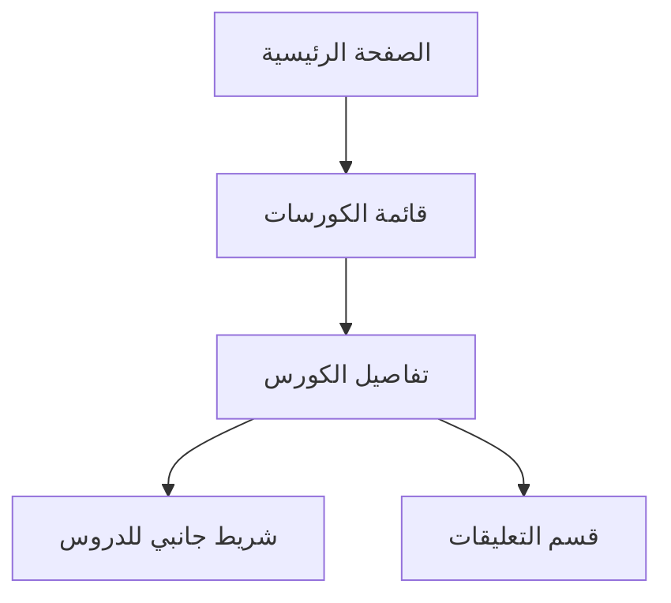

## 1. نظرة عامة على المنتج
نظام واجهة أمامية لمنصة تعليمية (LMS UI) مبني باستخدام Next.js App Router و TypeScript و Tailwind CSS. يهدف المشروع إلى توفير تجربة مستخدم سلسة واحترافية لعرض الكورسات، تتبع التقدم، والتفاعل مع المحتوى التعليمي.
- حل مشكلة عرض المحتوى التعليمي بشكل منظم وقابل للتوسع.
- استهداف الطلاب والباحثين عن دورات تدريبية عبر الإنترنت.
- القيمة السوقية: واجهة مستخدم عالية الجودة، سريعة، وصديقة لمحركات البحث (SEO).

## 2. الميزات الرئيسية

### 2.1 أدوار المستخدمين
| الدور | طريقة التسجيل | الصلاحيات الأساسية |
|------|---------------------|------------------|
| طالب | تسجيل دخول (Mock) | تصفح الكورسات، مشاهدة تفاصيل الكورس، التعليق |

### 2.2 وحدات الميزات
1. **الصفحة الرئيسية**: عرض مختصر لأهم الكورسات، قسم الـ Hero، والتنقل السريع.
2. **صفحة قائمة الكورسات**: شبكة عرض الكورسات مع ميزة البحث والتصفية (UI فقط).
3. **صفحة تفاصيل الكورس**: عرض الفيديو، وصف الكورس، شريط جانبي لتتبع الدروس، وقسم التعليقات.

### 2.3 تفاصيل الصفحات
| اسم الصفحة | اسم الوحدة | وصف الميزة |
|-----------|-------------|---------------------|
| الرئيسية | Hero Section | عرض جذاب للكورسات مع زر للانتقال لقائمة الكورسات |
| قائمة الكورسات | Course Grid | عرض الكورسات في بطاقات (Cards) مع معلومات أساسية |
| تفاصيل الكورس | Course Sidebar | شريط جانبي لدروس الكورس مقسمة لأسابيع مع حالة التقدم |
| تفاصيل الكورس | Comments Section | إمكانية إضافة تعليقات وعرض التعليقات الموجودة |

## 3. العمليات الأساسية
يتصفح المستخدم الصفحة الرئيسية، ثم ينتقل لقائمة الكورسات. يختار كورساً معيناً ليفتح صفحة التفاصيل، حيث يمكنه مشاهدة محتوى الدروس، تتبع تقدمه عبر الشريط الجانبي، والتفاعل عبر التعليقات.

## 4. تصميم واجهة المستخدم
### 4.1 نمط التصميم
- **الألوان الأساسية**: أزرق احترافي (#2563eb)، رمادي فاتح للخلفيات، وأبيض للعناصر الأساسية.
- **نمط الأزرار**: حواف مستديرة (Rounded)، تأثيرات Hover ناعمة.
- **الخطوط**: خطوط San-serif حديثة وواضحة (مثل Inter أو Cairo).
- **نمط التخطيط**: يعتمد على البطاقات (Card-based) مع مسافات بيضاء مريحة للعين (8px spacing system).

### 4.2 نظرة عامة على تصميم الصفحات
| اسم الصفحة | اسم الوحدة | عناصر واجهة المستخدم |
|-----------|-------------|-------------|
| تفاصيل الكورس | Course Header | عنوان الكورس، Breadcrumbs، مشغل فيديو (Placeholder) |
| تفاصيل الكورس | Sidebar | قائمة الدروس، أيقونات القفل، شريط التقدم |

### 4.3 الاستجابة (Responsiveness)
- تصميم Mobile-first.
- الهواتف: تخطيط عمودي، الشريط الجانبي يظهر كقائمة منسدلة أو في الأسفل.
- الأجهزة اللوحية والمكتبية: تخطيط شبكي (Grid) مع شريط جانبي ثابت (Sticky).
