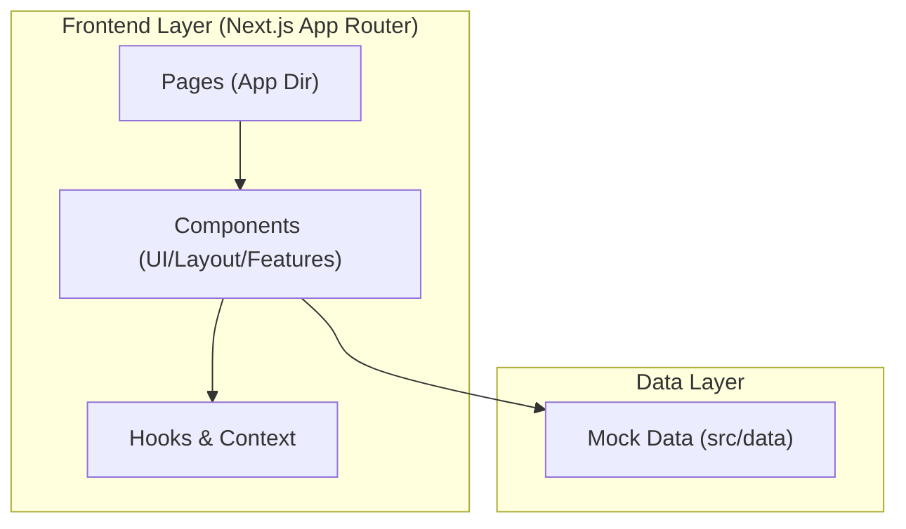
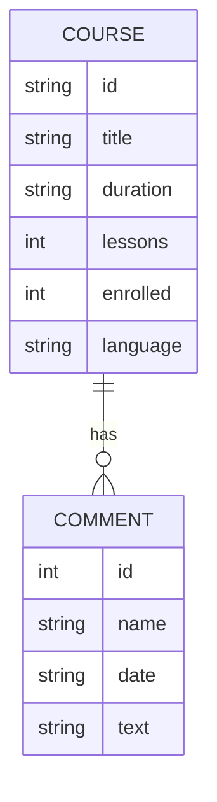

## 1. تصميم الهيكلية

## 2. الوصف التقني
- **Frontend**: Next.js 14/15 + Tailwind CSS + TypeScript.
- **Animations**: Framer Motion (للانتقالات السلسة).
- **Icons**: Lucide React.
- **Styling**: Tailwind CSS مع نظام 8px spacing.

## 3. تعريفات المسارات
| المسار | الغرض |
|-------|---------|
| `/` | الصفحة الرئيسية واكتشاف الكورسات |
| `/courses` | قائمة الكورسات مع البحث والتصفية |
| `/courses/[courseId]` | صفحة تفاصيل الكورس والمحتوى التعليمي |

## 4. نموذج البيانات
### 4.1 تعريف نموذج البيانات

### 4.2 تعريف البيانات (Mock)
تخزن البيانات في ملفات TypeScript ثابتة داخل مجلد `src/data/` لمحاكاة استجابة الـ API.
